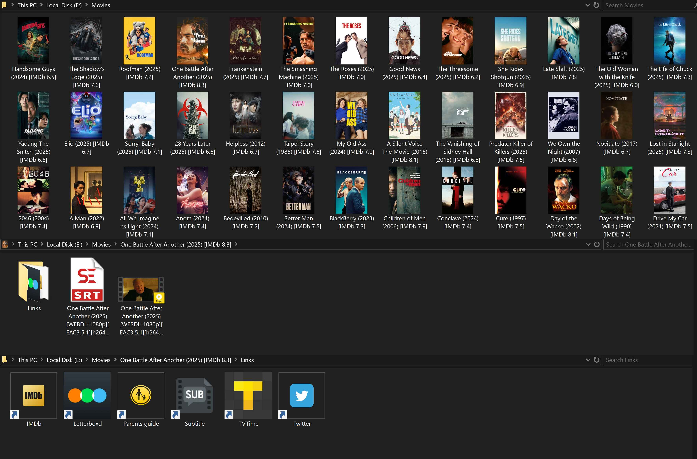

# arr_finisher

Finishing touches for Sonarr/Radarr libraries on Windows. After every import
(or during a nightly sweep), each series or movie folder gets a **poster-based
folder icon**, a **rating suffix in the folder name**, a **Links/ subfolder**
of handy web shortcuts, and a **hover tooltip** with the plot summary.



---

## What it does

| Output | How |
|---|---|
| **Folder icon from the show's poster** | Drives [maforget/Folder-Icon-Creator](https://github.com/maforget/Folder-Icon-Creator) — the original motivation for this project |
| **Rating suffix in folder name** | `[IMDb 8.6]`, `[MDL 7.5]`, or `[MAL 9.3]` — picks the best source automatically (see below) |
| **`Links/` subfolder with shortcuts** | IMDb, Parents Guide, TVTime, Letterboxd, MyDramaList, MyAnimeList, Twitter, combined Subtitle (SubDL + Subsource + OpenSubtitles) |
| **Explorer tooltip** | OMDb plot summary + rating shown on hover, via `desktop.ini` `InfoTip` |
| **Sonarr/Radarr path sync** | Folder rename is mirrored via API with atomic rollback — disk and service never drift |

### Rating source auto-detection

- **Korean** content → [MyDramaList](https://mydramalist.com) (via the unofficial [kuryana](https://github.com/tbdsux/kuryana) API)
- **Anime** → [MyAnimeList](https://myanimelist.net) (via [jikan](https://jikan.moe))
- **Everything else** → IMDb (via [OMDb](https://www.omdbapi.com); falls back to scraping `imdb.com` JSON-LD if OMDb is unavailable)

A title-similarity + year filter rejects bad fuzzy matches, so you don't
accidentally end up with the wrong rating for "Bones (2005)" vs some other show.

---

## Install

**Prerequisites:**
- Windows (script uses `pywin32` for `.lnk` creation and `desktop.ini`)
- Python 3.10+
- [maforget/Folder-Icon-Creator](https://github.com/maforget/Folder-Icon-Creator) — download a release, extract (e.g. to `D:\Tools\FolderIconCreator\`), and note the path to `Creator.exe`

**Install the script:**
```bash
git clone https://github.com/roko-tech/arr_finisher.git
cd arr_finisher
python -m pip install -r requirements.txt
copy .env.example .env
```

Then edit `.env` with your API keys (see [Configure](#configure) below) and verify:
```bash
python arr_finisher.py --validate
```

---

## Configure

All config lives in `.env` (created from `.env.example`). Real OS environment
variables override the file.

| Key | Required | What it's for |
|---|:---:|---|
| `SONARR_API_KEY` | ✓ | Sonarr → Settings → General |
| `RADARR_API_KEY` | ✓ | Radarr → Settings → General |
| `OMDB_API_KEY` | ✓ | Free key from [omdbapi.com](https://www.omdbapi.com/apikey.aspx) |
| `FOLDER_ICON_EXE` | ✓ | Absolute path to Folder-Icon-Creator's `Creator.exe` |
| `SONARR_API_URL` | | Defaults to `http://localhost:8989` |
| `RADARR_API_URL` | | Defaults to `http://localhost:7878` |
| `SUBDL_API_KEY` | | Only used by the combined Subtitle shortcut to resolve direct links |
| `OPENSUBTITLES_API_KEY` | | Same purpose |
| `SEARCH_LANGUAGE` | | ISO code (`ar`, `en`, `ja`, …) for the Twitter hashtag filter + OpenSubtitles listing. Defaults to `ar` |
| `KURYANA_BASE_URL` / `JIKAN_BASE_URL` | | Mirror overrides if you self-host |
| `ARR_FINISHER_LOG_LEVEL` | | `DEBUG` for verbose permanently; default `INFO` |
| `ARR_FINISHER_LOG_DIR` | | Directory for `arr_finisher.log`. Defaults to the repo dir, with `%TEMP%` as fallback |
| `ARR_FINISHER_RATING_CACHE_TTL_DAYS` | | Sweep cache freshness window. Default `7` |
| `ARR_FINISHER_SWEEP_ROOTS` | | Pipe-separated `path:service` pairs used by `--sweep` when `--roots` is not passed |

---

## Run

Three ways to invoke it:

### 1. As a Sonarr/Radarr custom script (primary use)

**Settings → Connect → Custom Script** → `<repo>\arr_finisher.bat`.

Trigger on `On Import` and `On Upgrade`. The `.bat` auto-locates the `.py` via
`%~dp0`, so you can keep the repo anywhere. The `Test` event Sonarr/Radarr fires
when you click "Test" in the UI is acknowledged but does nothing.

### 2. Nightly sweep (rating-refresh safety net)

The webhook handles every new import in full. The sweep is a **rating-only**
follow-up that runs nightly to keep ratings fresh as they evolve over time.
For each folder it:

1. Looks up its IMDb ID in Sonarr/Radarr
2. **Skips if the rating was checked in the last 7 days** (cached locally in
   `.rating_cache.json`)
3. Otherwise fetches a current rating from the right provider
4. **If the rating changed** → renames the folder + updates the path in
   Sonarr/Radarr via API (with rollback on API failure, so disk and service
   never drift)

Folder icons, shortcuts, and tooltips are **not** re-touched during sweep —
the hook already did that when the content was imported. A typical nightly
sweep on a fully-cached library finishes in ~10 seconds.

Schedule it at 3 AM daily:

```powershell
schtasks /Create /TN "arr_finisher_nightly_sweep" `
    /TR "\"<repo>\arr_finisher_sweep.bat\"" `
    /SC DAILY /ST 03:00 /RL HIGHEST /RU SYSTEM /F
```

The 7-day TTL is `RATING_CACHE_TTL_DAYS` near the top of `arr_finisher.py`.
Delete `.rating_cache.json` to force a full refresh on the next sweep.

### 3. Manual / one-off

```bash
python arr_finisher.py --validate                                 # config + connectivity check
python arr_finisher.py --sweep                                    # process every folder
python arr_finisher.py --sweep --dry-run                          # preview without touching anything
python arr_finisher.py --service sonarr --path "D:\TV Shows\Foo"  # single folder (looks up env vars from Sonarr/Radarr)
python arr_finisher.py --clear-cache                              # wipe .rating_cache.json
python arr_finisher.py --refresh tt7160070                        # invalidate one IMDb ID so next sweep re-fetches
python arr_finisher.py --verbose                                  # include DEBUG-level logs
```

### Sweep roots

Default roots come from `ARR_FINISHER_SWEEP_ROOTS` (pipe-separated `path:service` pairs).
If that env var is unset, the hardcoded fallback in `_default_sweep_roots` is used:

```python
[
    (r"D:\TV Shows", "sonarr"),
    (r"D:\Anime",    "sonarr"),
    (r"E:\Movies",   "radarr"),
]
```

Override per-invocation with `--roots "D:\Shows:sonarr" "F:\Movies:radarr"` (the
service is matched on the last colon, so Windows drive letters in the path are fine).

---

## Feature toggles

At the top of `arr_finisher.py` — every behavior is independently switchable
(rename, icon, shortcuts, tooltip, MDL/MAL, subtitle combo, etc.). Defaults are
sensible; flip what you don't want.

## Tests

```bash
tests\run_tests.bat       # fast unit tests
tests\run_tests.bat all   # + integration tests (hits kuryana + jikan)
```

## Credits

- **[maforget/Folder-Icon-Creator](https://github.com/maforget/Folder-Icon-Creator)** — the folder-icon generator this whole project is built around. None of this exists without it.
- **[kuryana](https://github.com/tbdsux/kuryana)** — unofficial MyDramaList API.
- **[jikan](https://jikan.moe)** — unofficial MyAnimeList API.
- **[OMDb](https://www.omdbapi.com)** — ratings + plot summaries.

## License

MIT — see [LICENSE](LICENSE).
